# Community Broadband Financial Sustainability Model

Simon Molloy and Barry Burgan of System Knowledge Concepts (SKC) 
and Jonathan Brewer of Telco2

## 1. Model description
### 1.1 Introduction
The Association for Progressive Communications (APC) commissioned Systems Knowledge Concepts (SKC) and Telco2 to develop a quantitative economic and financial model to enable the evaluation of the financial sustainability of different community-based communications solutions in under-serviced communities.

Systems Knowledge Concepts is an Australian economics consultancy specialising in telecommunications and economic development. Telco2 designs and builds innovative networks for broadband, public safety, utilities, and the Internet of Things.

Simon Molloy and Barry Burgan of SKC worked with Jonathan Brewer of Telco2 to develop and integrate the model into an Excel sheet. This team collaborated with Carlos Rey-Moreno and Mike Jensen of APC on the work in 2024.

Telco2 ported the Excel model to Python and developed a web user interface for it in 2025.

An advisory committee was set up to accompany this process. The members of the committee were
Jane Coffin, Revi Sterling, Laina Green, Steve Song, Ben Matranga and representatives of Connect
Humanity (initially Jochai Ben-Avie, and later Erica Mesker, Brian Vo and Nathalia Foditsch).

The development of this application is part of the Local Networks initiative, a collective effort led by APC and Rhizomatica in partnership with grassroots communities and support organisations in Africa, Asia and Latin America and the Caribbean. Its production was supported by the "Meaningful community-centred connectivity" project implemented with financial support from the Swedish International Development Cooperation Agency (Sida) and UK International Development from the UK Government through its Digital Access Programme. The views expressed here do not necessarily reflect the supporters' views.

### 1.2 What is the Community Broadband Financial Sustainability Model?
The SKC Community Broadband Financial Sustainability Model (‘the model’) is a community-level, reusable and user configurable, financial and cost-benefit model designed to assist decision makers in planning broadband deployments for under-serviced communities.

The model enables a wide range of ‘what if’ scenarios to be explored. On the basis of the user-defined parameter values, the model produces a comprehensive set of outcome measures including ‘Proportion of total potential users supported’, Adoption level (% of possible subscribers)’, Average Annual EBIT (Earnings Before Interest and Tax) (US$), and Financial Return on Investment (IRR (Internal Rate of Return) of Cash Flows).

These outcome measures enable the user to experiment with different scenarios by changing the model settings and seeking solutions that will provide the best outcome for users at the minimum cost over the life of the network. In colloquial teams, the model encompasses all the major technologies deployed (fiber, wireless, satellite, public access) and enables the user to search for the ‘best bang for buck’ solution.

It is important to emphasise that identifying the optimal solution requires solving, not only engineering, but also economic problems. It is one thing to provide a technically effective connectivity solution. It is another to provide one that individuals can afford to buy, and that will be economically sustainable.

Building financial models requires abstraction from reality and simplification. In reality, every under-serviced community is unique, with a complex set of contexts and characteristics. This complex reality not only makes it difficult for the designers of connectivity systems to determine the most efficient communications solutions for each community, but it also makes it hard to create a financial model that is applicable to a wide range of circumstances.

While there are many differences between communities, there are also many common characteristics. Some of the characteristics that influence the choice of broadband provisioning solutions in any community include:

demographics: population size, growth rates, age distribution, user types

spatial: size of service area, its shape, topography and distance from urban areas where backhaul links may be found

economic: income levels, income distribution, prevalence of market-based activities and cash incomes, cost of finance, cost of equipment, the availability and extent of subsidies, required operating margin.

In addition, there are multiple technical considerations such as:

type of broadband technology to be used

the nature and cost of options for backhaul connectivity

availability and reliability of power

the frequency and amount of spectrum available

terrain and vegetation characteristics (which affect signal propagation).

In order to provide analytical leverage and insight, the model necessarily abstracts from real-world complexity. Within the modelling framework, an underserved community is represented as a ‘scenario’. Within the model, a scenario is defined by the model as the set of user-entered parameter values that characterize the community being investigated.

This list of relatively ‘mechanistic’ parameters is not intended to suggest that a range of historical and/or cultural factors may not be important in decisions about providing communication solutions. The model is designed to assist broadband solution planners manage the mechanistic parameters, experiment with trade-offs and investigate optimal solutions.

### 1.3 Overview of model structure and components
The model is made up of four main components:

A user input section where parameter values are entered to characterise the target community (described in more detail in Section 2). Also, a choice of technologies that could be used to serve the connectivity needs of the community is available for selection from a menu of FWA, GPON, LTE and WiFi options.

A Broadband Technology Module (BTM) that processes relevant parameter values and determines technical outcomes such as number of users supported, coverage area, power requirements and all associated CapEx and OpEx costs.

A Broadband Demand Module (BDM) that processes user-defined parameter values and outputs of the technology module, filtering these through a demand analysis to determine the expected number of users, adoption levels, financial performance and economic benefit outcomes (see Section 4).

An output section that summarises all of the main community, network, financial and economic benefit outcomes. (see Section 3)

 Figure 1 below provides a high-level illustration of the model.

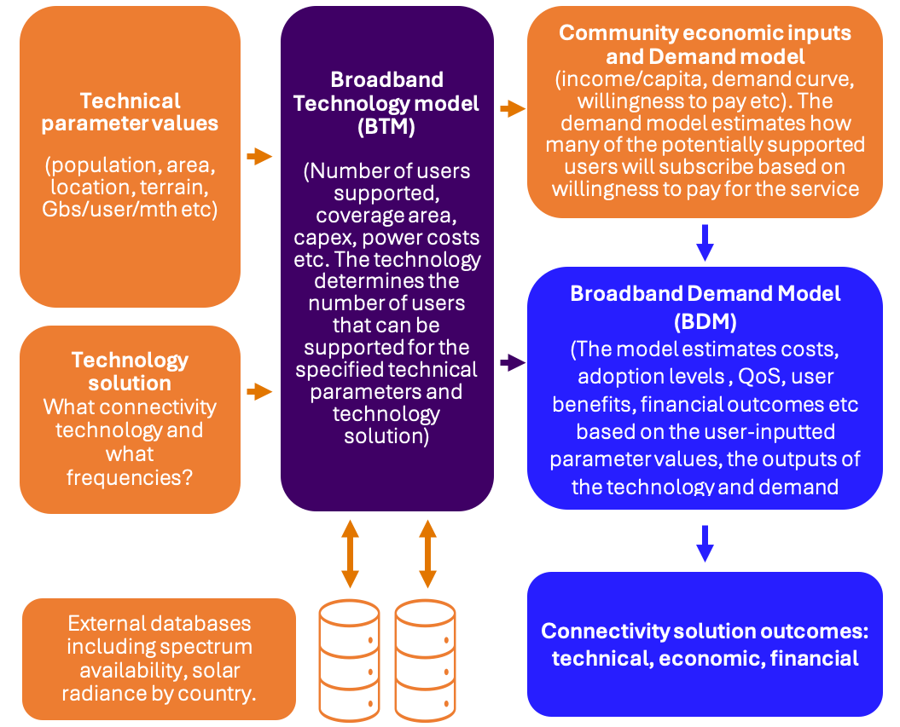
The user of the model enters parameter values in the user interface that characterises the community and technology / business scenario being investigated. The model takes these values and passes them to the BTM which component estimates the number of users that can be supported, and the associated capital and operational costs, including power costs. These results are then passed to the BDM. The BDM combines the results from the BTM with other parameter values from the user interface. For example, the price of connectivity services is derived from the cost of providing the service (Capex and Opex), the number of expected users (in the different user categories) and the required operating margin.

Using demand modelling parameters the BDM, in a sense ‘filters’ the results of the BTM by determining how many users will actually pay for the service, that is, become ‘adopters’ or ‘subscribers’, based on average incomes, willingness to pay and service price.

It is this combination of technical and economic modelling at the community level that makes the SKC model effective for analysing and planning connectivity solutions in specific unserved and under-serviced communities. In this respect it is not designed as a regional or national analysis tool – it is focused on individual communities, although modelling could be carried out on multiple communities to derive a regional assessment, and similarly, different business strategies and technology models could be compared across different community types.

The size of these communities can vary significantly in population and geographic extent but the connectivity solutions are regarded a single self-contained solution for a community as defined in the user interface. Section 3 describes in more detail the underlying economics of the model.

The BDM is implemented in Python currently implemented in an Excel workbook with a set of spreadsheets containing different components of the model. The first tab, called ‘User interface’ - is the only spreadsheet that users need to interact with. The BTM resides on an independent web server along with a set of databases. 

The next section describes how model users interact with the model and interpret its results.

### 1.4 Terminology
#### 1.4.1 Users and their types
The terms ‘user’ and ‘users’ appear frequently throughout this document. If the reference is to individuals who interact with the model, the terms ‘model user’ or ‘user of the model’ are used.

If the reference is to a community user of the connectivity solution, the term ‘user’ applies. This will often be modified as follows:

potential user: an individual who may eventually adopt the solution but has not yet used it, with this figure being equal to the number of households multiplied by the number of users per household.

a non-user: an individual who will not become a subscriber or use a PAF. For most economies available to the model, the percent of non-users per household is pre-populated with an estimate based on population distribution from the 2024 UN World Population Prospects. Household members ten years or younger, and eighty years or older are considered non-users. The proportion of non-users is adjustable in the Expert Options section of the user interface.

a user: an individual who has adopted the solution, also a ‘solution user’.

a deterred user: a user who would have become a subscriber but chooses not to because this user finds Public Access Facilities (PAF) more attractive. The sense in which the word is used, is that a potential user is deterred from becoming a subscriber if a PAF is available.

a PAF-user: an individual who would not become a user of a subscribed service (at the current parameter values) but would use a PAF.

#### 1.4.2 Decision makers: households, service providers, businesses and individuals
In order for a ‘demand driven’ model to function, it is necessary to define carefully what entity is making economic decisions – who is doing the demanding?

In this model we assume the adoption decision is taken at the household level for individuals and households, and at businesses and services provider levels for these organisations.

These are simplifying assumptions, but ones that enable the model to minimize complexity while still being grounded in reality. It is likely that in reality, decisions about the adoption of connectivity solutions will vary according to the type of technologies on offer, demographics, household income, cultural factors and a range of other influences. For example, the decision to adopt a ‘household based’ solution with a household access point will likely be taken by the household, while the decision to adopt an ‘individual based’ technology such as a 4G handset may be undertaken by an individual.

To contain the model’s complexity, the model assumes that adoption decisions for all connectivity solutions are made at the household level, including individual based technologies. This is clearly a simplification but it is not unreasonable to assume, particularly in income-constrained households, that significant economic decisions are made at the household level. This obviously applies in the area of household-based technologies (a fixed broadband connection), but also at the level of individual-based technologies such as handsets.

In reality, these markets are made up of complex and interacting submarkets, for example, the market for handset-based and household-level connectivity solutions, Public Access Facilities (PAFs) and potentially pre-existing carrier-delivered solutions. Economic models that reflect this complexity could be developed, but the data required to drive such a model is well beyond anything that is in practice, unobtainable.

#### 1.4.3 Connectivity solution and broadband
The system of telecommunications hardware, power systems and associated operation services are collectively referred to as the ‘connectivity solution’, or ‘solution’ if the context is obvious. The term ‘broadband’ is also used to describe services for variety of expression. With all services being delivered over IP the term broadband described all aspects of a connectivity solution.

## 2 Model user interface
### 2.1 How does a user interact with the model?
The model user needs to enter values for a variety of parameters that characterise a particular community. In striking the balance between simplicity and complexity, not all of the model parameters are exposed to the user, especially the more technical elements, however these can be adjusted by the model developers if necessary. The set of all the user-defined values for the model constitutes a ‘scenario’.

In this section, a user input field name appears in italics and the cell into which the parameter value is entered is described in terms of the part of the website it can be found in.

Descriptions of all of the user-defined parameters are provided below unless they are self-evident.

### 2.2 Run the Model
After the model user enters or changes parameter values, it is necessary to click the green “Run the Model” button. This will send the updated parameter values to the remote web server that contains the BTM and return values to the user interface. Form validations prevent the model from running if a complete technology solution is not yet defined.

### 2.3 Entering parameter values
In this section the options for describing the characteristics of the community are outlined. The user-defined parameters are divided into logical groups such as Community characteristics, Commercial/economic characteristics and subsidies, and Physical environment characteristics. 

Any cells shaded red have been populated with default parameters that may not be appropriate to the community being modelled - please take extra care to adjust these.

Throughout the model most parameters have range limitations on them, and user input above or below reasonable thresholds will be automatically corrected.

The selection of connectivity technologies to be used is then outlined in the following section.

#### 2.3.0 Select your Country
Country selection populates a number of default variables into the model based on available demographic data and physical location data. In this version of the application, configuring a model then changing the country can have unpredictable results. It’s best to refresh the page entirely before starting a model in a different country.

##### 20.3.0.1 Default Variable Sources
In all cases where data is present in the recent past, a value is drawn from the most recent year available in the data sets below. This means that, for example, if 2021 is the latest population data available for a country in the 2024 data set, the 2021 data will be used.

Population Data: United Nations World Population Prospects 2024

World Population Prospects 

Household Size: United Nations Department of Economic and Social Affairs 2022

https://www.un.org/development/desa/pd/household-size-and-composition

GDP Per Capita: World Bank 2023

World Bank Open Data 

Population Growth Data:  World Bank 2023

World Bank Open Data 

Power Pricing: World Bank Doing Business 2019

Doing Business | DataBank 

Inflation: International Monetary Fund 2024 via World Bank

World Bank Open Data 

#### 2.3.1 Community characteristics
Values for the Community characteristics parameters are shown below. The parameters have basic default values set, so if the model user is in doubt, the value can be left as-is. 

Model users can input values for the coverage area in km2 required, the total number of households in the coverage area, the expected population growth rate, and the weekly household income. Since these values are community averages, fractional values are allowed, also, such as for Area, where many villages will be much smaller than 1sq km. The other parameters are self-explanatory.

The value for total potential users, hidden in the Expert Options section, is derived from the number of households input in this section multiplied by the household size, minus the percent of non-users.

In the Additional User Types section, model users define the number of businesses and service provider organisations in the community, and the average number of employees or telecommunications services users associated with each entity type.

#### 2.3.2 Technology Selection
Technology choices are of paramount importance in building community broadband coverage. While a network may have several (or all) technologies, limiting the scope of the network limits the complexity a user is exposed to in the network builder section.

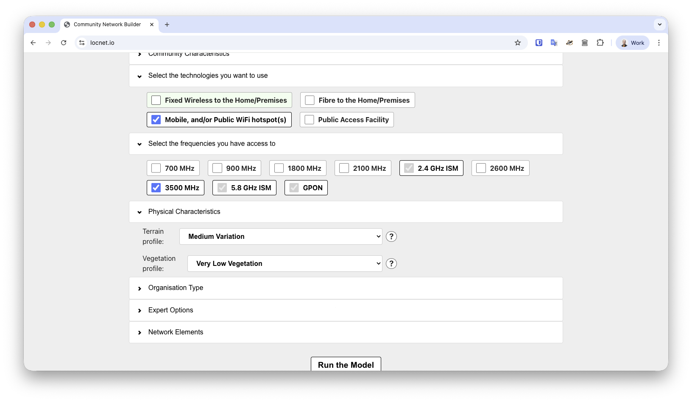
 

##### 2.3.2.1 Fixed Wireless
A microcell or small-cell solution used for fixed wireless data-only access. Users connect to the network with a terminal typically installed on their rooftop, the side of their dwelling, or in a window. The terminal provides a Wi-Fi hotspot that acts as a connection for the entire household.

##### 2.3.2.2 Mobile, and/or Public WiFi hotspot(s)
A microcell or small-cell solution for providing data-only access to portable devices. Calls and messaging are only supported through Over the Top (OTT) applications. These networks may or may not support mobility, and do not support roaming.

##### 2.3.2.3 Fibre to the Home / Premises
Gigabit Passive Optical Network, or GPON, is a fibre to the premises technology. The GPON user terminal connected to the fibre provides a Wi-Fi hotspot that acts as a connection for the entire household. Fibre solution cost is highly dependent on labour inputs and population density.

##### 2.3.2.3 Public Access Facility
Internet Cafés, libraries, community centres, and schools with public access computer rooms can all be considered a Public Access Facilitie (PAF). This model assumes users are charged for access to the facility, and that the presence of a PAF might reduce the use of other technologies as it can be a less expensive option for users with limited needs and/or means.

When a user selects PAF as a technology for use in the model, they’re prompted to enter the amount of use by each of three user profiles: non-subscribers, subscribers, and deterred users. The supply model can’t know the percent of users that will be assigned to each category, as these figures are calculated after the total solution cost is determined and its affordability assessed against the demand curve. Absent the exact breakdown the supply model takes the highest predicted use in hours of the three categories, and uses this to determine the loading on the PAF. The model  estimates that seats will be open 10 hours per day, six days per week, but occupied 50% of the time, allowing for 129 hours of PAF use per seat per month. For the demand model this figure is doubled to show true availability of seats.

#### 2.3.3 Frequency Selection
Builders of Fixed Wireless and Mobile networks might have access to dedicated radio spectrum. The frequency available has an impact on both coverage and solution cost. Wi-Fi bands that are universally available (or nearly so) are selected by default and cannot be unselected.

Lower frequencies have greater coverage, especially in the presence of vegetation. The equipment is larger, more expensive, and uses more power than higher frequency equipment - and so has higher Capital and Operational expenses. Higher frequency equipment is physically smaller, and uses less power, but provides far less coverage in the presence of vegetation. 

#### 2.3.4 Physical environment characteristics
For wireless networks, the characteristics of the terrain and vegetation may have a significant negative impact on signal propagation. This effect is more pronounced the higher the frequency used in the connectivity solution.

Terrain: the user selects a terrain type from the drop-down list that best matches local conditions. 

Terrain is a coarse control for model users to estimate how terrain may block signals from a tower location to end users. In the event hills or mountains prevent half of users in a normal coverage area from line of sight to a tower location, “Very High Variation” can be selected and coverage area will be reduced by 50%.

Vegetation: the user selects a vegetation type that best matches local conditions.

The vegetation profile represents how much vegetation (in meters) is between an end user and the nearest communication tower. The more vegetation there is, the more it blocks or weakens the radio signal, limiting coverage. Vegetation absorbs and scatters the signal, and the effect is greater at higher frequencies. You can select from various options, ranging from no vegetation (0 meters) to very high vegetation (100 meters), to account for the impact on your wireless coverage. This helps the model estimate how signal strength will be affected in your environment.

#### 2.3.5 Organisation Type
This section of the model enables a user to choose either commercial or community provision of the connectivity solution.

Commercial organisations require a Return on Investment (ROI) with profit targets, while community operators generally work towards a cost-recovery / non-profit model. Commercial operators also tend to provide higher levels of service. Changing the value in this section changes the default values applied to a number of business and technical variables hidden in the Expert Options. All of these default values are changeable by model users, however the act of selecting an Organisation Type always overwrites custom Expert Option values with defaults.

#### 2.3.6 Expert Options: Business Options
##### 2.3.6.1 Labour Cost
Cost of labour has a major impact on both Community and Commercial provision of networks. Where data is available, the estimated figures for household income and labour cost are derived from GDP per capita and household size. Where no data is available, the figure may be shaded red as a warning it must be changed in order for the model to have any degree of accuracy.

##### 2.3.6.2 Customer Service OpEx - fixed
This figure represents the number of paid Full Time Employees (FTEs). It specifies the fixed operating expenditure for customer service (the expenditure that does not vary by the number of system users) specified by the number of full-time employees required. Community provision may have a lower value than corporate provision because of voluntary contribution of labour by community members.

##### 2.3.6.3 Customer Service OpEx - variable
This specifies the customer service operating expenditure that varies with the number of network users, and is expressed as the number of full-time employees per 100 users. Community provision may have a lower value than corporate provision because of voluntary contribution of labour by community members.

##### 2.3.6.4 Maintenance OpEx
Maintenance is an annual charge based on a percentage of cost of building the network.

##### 2.3.6.5 CapEx Subsidy as a % of total CapEx
The percentage of capital expenditure funded by subsidies (assumed to be paid at the end of the first year).

##### 2.3.6.6 OpEx Subsidy as a % of total OpEx
The percentage of Operational Expenditure funded each year for the life of the solution

##### 2.3.6.7 User Equipment Subsidy
The percentage of the total cost of personal equipment for end users that has been subsidised. For example, if handsets are given away free to network users, set this figure to 100.

##### 2.3.6.8 Cost of User Equipment
This figure defines what a user would expect to pay for an Internet-capable smartphone or tablet. In economies where these devices are inexpensive and easy to access, the number might be adjusted downward from its default of 100 USD. In economies where devices are regulated and taxed, the number might be adjusted upwards. Cost of user equipment is often a significant barrier to adoption of broadband services, so it’s important to have a market-specific number entered here. 

##### 2.3.6.9 Cost of Finance
This is the interest rate on the proportion of Capex that is funded by debt. This may or may not be lower in the case of community provision compared to commercial provision.

##### 2.3.6.10 Proportion of Capital funded by Debt
This figure describes how much money has been borrowed in order to build the network, as a percent of overall CapEx.

##### 2.3.6.11 Weighted Average Cost of Capital
The required return on the project, or target Weighted Average Cost of Capital (WACC) as a percent. The required rate may be lower for community provision than for commercial provision.

WACC is defined as the average rate a company pays to finance its assets. It is calculated by averaging the cost of each capital source (debt and equity), weighted by the proportion of each source. WACC incorporates the fact that the two sources of business funding: equity and debt, both require a return for providing capital. The return to equity is dividends and the return to debt is interest. Different businesses are funded by different ratios of equity and debt and WACC takes into account the cost to the business of both of these sources of funding and the ratio in which they are used. WACC is a key factor in many business decisions, including pricing, investment evaluation, and strategic planning.

WACC is calculated using the following formula 𝑊𝐴𝐶𝐶=𝑅𝑒⋅𝐸+𝑅𝑑⋅𝐷 where:

Re: Return on equity, or cost of equity

Rd: Return on debt, or cost of debt

E: Proportion of business funded by equity

D: Proportion of business funded by debt

It should be noted that WACC ex ante may be different to WACC ex post. A company may have debt that is subject to variable interest rates. If these interest rates change over the accounting period, anticipated and actual WACC will differ.

For the purposes of the model, the target WACC should be used. This value is important because it summarises the expected cost of financing capital for the organisation that delivers the connectivity solution.

This cost of financing needs to be added to the other OpEx, and CapEx costs associated with the solution and it therefore forms a component of the overall costs that need to be covered by subscriber revenues. Therefore, a higher target WACC will imply a higher subscription fee.

##### 2.3.6.12 Expected Inflation
Inflation is used throughout the demand and financial model. The default figure of 3% should be adjusted for the local market.

##### 2.3.6.13 Corporate Tax Rate
For community operators, this is set by default to 0, and for commercial operators to 10%. If a commercial operator is being modelled, set this figure appropriately for the local environment.

##### 2.3.6.14 Initial Spectrum Licence Fee
Any fees to use spectrum over the life of the project should be included here, in USD.

##### 2.3.6.15 Other Operational Expenses
This cost category covers office costs and overheads. It’s expressed as a percentage of other labour costs above. Community provision may have a lower value than corporate provision because of voluntary contribution of labour by community members.

##### 2.3.6.16 Margin on Operating Cost
This category allows any differences in required margin on operating costs between commercial and community provision to be accommodated in the model. Note that this margin is on OpEx only.

##### 2.3.6.17 Cost Discount for Community Operators
For a variety of reasons, the cost of capital equipment may be lower for community provision than for commercial provision. The discount of the cost of capital equipment for community provision compared to commercial is expressed here as a percentage discount. If, for example, the type and cost of capital used for community provision was exactly the same as for commercial provision, this discount would be set to zero. If the equipment for the network were grant-funded, it would be set to 100.

#### 2.3.7 Expert Options: General Options
##### 2.3.7.1 System Life
The financial and business planning module is based around a design life of ten years, but systems can be extended up to twenty years to take advantage of long-life infrastructure like towers and power systems. The cost of replacing shorter lifespan equipment like electronics and radios is factored in automatically. As this model designs for network capacity in its final year of use, mobile wireless systems might be very expensive and show very low support for users. GPON is usually the best choice for systems with planned lifespans of greater than ten years.

##### 2.3.7.2 Year 1 Traffic
The expected traffic consumption, in Gigabytes per month per user, in the first year of the system’s operation. By default this figure is 10 GB per month, however it should be adjusted for the local market. In Sub-Saharan Africa it could be as low as 5 GB per month, while in South Asia it might be closer to 30 GB. Ericsson’s Mobile data traffic outlook is a good resource for calibrating demand.

##### 2.3.7.3 Traffic Growth
Growth in data consumption has averaged between 20-30% per annum in most markets over the past twenty years. This growth rate, in conjunction with the Year 1 Traffic figure, is used to dimension capacity for the access network. It’s also used as an input into the cost of buying backhaul over the life of the network.

##### 2.3.7.4 Household Size
Fixed technologies like GPON and Fixed Wireless use a single terminal to service a whole household, providing a Wi-Fi hotspot inside the home. This makes them particularly cost-effective in economies with large household sizes. The default household size per country is sourced from UNDESA Population Demographics 2022. As an average across the country, it might not be appropriate for the community modelled. If this cell is red, UNDESA data did not contain data for the economy and the default must be updated for accurate results.

##### 2.3.7.5 Non-Users per Household
By default this model considers children under ten and adults over eighty years to be non-users of of the network. The percent figure, when available (and not shaded red) is sourced from United Nations population data (2024).

##### 2.3.7.5 Users per Household
This figure is unchangeable in the model, as it is derived from the household size and the percent of non-users per household.

##### 2.3.7.6 Total potential users
The model users limit the number of potential users of the system in multiple ways. First it determines  how many households are present in the study area. Out of those households it limits the users to household members above 10 years and below 80 years of age. Household users are then added to Service Provider users and Business users to determine the total potential users of the network. This treatment can result in an over-estimation of peak hour demand, as peak hour use profiles differ between service providers and business users. It may be corrected in the future.

##### 2.3.7.7 Users above Median Income with Internet Capable Phones
The demand model breaks users into groups above and below median income, and treats their ability to pay and consumption of services differently. One key factor is pre-existing access to an Internet-capable handset. The default figure of 30% means that 70% of users in this market segment will need to buy a handset in order to use the community network.

##### 2.3.7.8 Users above Median Income with Internet Capable Phones
For users below median income, the default figure of 10% means 90% of users in this market segment will need to buy a handset in order to use the network.

#### 2.3.8 Expert Options: Public Access Facility Options
Public Access Facilities (PAFs) are ‘Internet Café’ type facilities that provide connectivity access in a public environment to any community members who needs it, such as those who don’t own access devices. In the online version of the model, the number of facilities and number of seats per facility are configured in the network builder section. Other parameters relating to the impact of PAFs are configured in the Expert Options.

##### 2.3.8.1 PAF use by a Deterred User
A 'deterred user' is one who would have become a subscriber to the community network, but decides not to because of the availability of Public Access Facilities. This figure is an estimate of the average number of hours per month per deterred user. It impacts the capacity and availability of the facilities. When PAF is the only solution configured by a user of the model, this figure is set to zero regardless of user input. 

##### 2.3.8.2 PAF use by a Subscriber
This field is an estimate of the number of hours that subscribers to alternative community network solutions will use the PAF. The number of PAF users will vary with the number of terminals. We assume terminals are available 12 hours a day 365 days a year. The number of PAF users is a function of the number of terminals supplemented by a congestion factor. When PAF is the only solution configured by a user of the model, this figure is set to zero regardless of user input. 

##### 2.3.8.3 PAF use by a Non-Subscriber
A ‘non-subscriber’ is a community member who would not have subscribed to a community network offering (at current parameter values). The average number of hours per month that ‘non-subscribers’ use the PAFs is entered here.

##### 2.3.8.4 Use of Internet Traffic Per Hour
This is the traffic in Gigabytes (GB) per hour generated by the average user of the PAF. It’s used to help dimension the backhaul network and to determine the cost of providing the traffic.

##### 2.3.8.5 Charge for Public Access Facilities Use
This is the hourly charge for use of a PAF terminal and is expressed as a proportion of weekly household income per hour of use. By default the charge is 1/2 of 1 percent of weekly household income per hour. Adjusting the percentage here will adjust the USD fee used in the model.

#### 2.3.9 Expert Options: Power Options
Power systems and power use are often the most expensive inputs to providing a network service. In its present state the application choses a least cost power system based on inputs including materials costs and solar collection potential of the country chosen.

##### 2.3.9.1 Mains Power Installation Cost
The cost in USD of installing mains power. The default figure is derived from World Bank Doing Business statistics as a fraction of the cost of installing power to a warehouse in the selected country. Should mains power be unavailable at the selected network location, set this figure to an estimate of what it would cost to install it. A sufficiently high figure (for example several tens of thousands of dollars) will force the model to prefer a solar-only power system.

##### 2.3.9.2 Mains Power Cost per kWh
The cost in USD of paying for mains power use. The default figure is sourced from World Bank Doing Business statistics. Adjust as appropriate if available power is more or less expensive.

##### 2.3.9.3 Solar Power Cost per Watt
The estimated cost of installing solar panels, including their installation on a frame or a rooftop. Should solar power be impractical or impossible for this community network, set the figure to as realistic of an estimate as possible. A sufficiently high figure (for example tens of dollars per Watt) will force the model to prefer a mains-only power system.

##### 2.3.9.4 Battery Cost per Watt Hour
For solar systems, batteries are generally the most expensive component of the system. Battery dimensioning is done automatically by the model based on the power demand of the technology solution, the location and expected temperatures, and the ability of the power supply. Set the cost per Watt hour to an accurate figure for deep cycle batteries available in the local market. 

##### 2.3.9.5 Battery Depth of Discharge
Different battery chemistries are optimised for different depths of discharge. Lead acid batteries intended for standby (non-cyclic) use degrade quickly when discharged below 50%. The default figure of 80% is optimised for LiFePo4 Lithium Ion batteries, and will result in a lifespan in excess of fifteen years.

##### 2.3.9.6 Charger Inverter Base Cost and Charger Inverter Variable Cost
A pair of inputs used to estimate the cost of providing charging and inverter infrastructure for a solar or hybrid solar/mains power system. A base charge is required so the model can accurately plan for small systems intended to power a few Wi-Fi hotspots, while the variable charge ensures accurate planning for large systems that may power cellular antenas. Using the default inputs of $50 plus $0.35 per watt, the cost of a 2,000W charger/inverter would be $750 USD.

##### 2.3.9.7 Solar Efficiency
In the past twenty-five years, solar panel efficiency has increased from around 12% to around 21% for the best panels today. Incremental improvements in technology and manufacturing process will increase this number in time. Change the default value if the panels you have access to are more or less efficient.

##### 2.3.9.8 Solar Derating
Most solar panels lose some capacity as they age. One half of one percent, the default value here, is appropriate for most types of panels.

##### 2.3.9.9 Battery Age Derating
Lead acid batteries in particular lose capacity as they age, with higher temperature and intensity of use contributing to a loss of between 3-10% capacity per year. Lithium batteries perform better, with a loss of between 1-3% per year. The default figure of 2% is appropriate for most new systems which should be built with LiFePO4 or similar lithium chemistry batteries.

##### 2.3.9.10 Reliable Power Hours
In locations with reliable power, operators should have some battery backup to infrequent losses of electricity. For community operators, this defaults to four hours of backup. For commercial operators the default is eight hours of backup.

##### 2.3.9.11 Intermittent Power Hours
This variable allows users to assign additional battery capacity to locations with intermittent power, for example microgrids or networks that implement load shedding. In this version of the model’s user interface, intermittent power situations are not available.

##### 2.3.9.12 Offgrid Power Hours
While a default variable is available in the user interface, the amount of hours of offgrid standby power is overwritten by the model. It is substituted with a capacity to support service over the maximum no sun equivalent period in a seven day window across the entire year, sourced from  NASA/POWER CERES/MERRA2 Native Resolution Climatology Climatologies v2.5.9 POWER Climatology API for the network’s location. In this version of the model, the network’s location is set to the centroid of the selected country.

##### 2.3.9.13 Hybrid Power Hours
Hours of standby power to provision for a dual solar and grid system used to save money in situations where grid power is expensive. A higher figure may be appropriate where power losses are common in winter or rainy seasons.

### 2.4 Network Elements
This section of the application allows users of the model to configure a technical solution. It is a complex process, and requires a basic understanding of networking technologies.

#### 2.4.1 Add Location
All networks must have at least one location configured for delivering service. Users will source their connectivity from one or more configured locations. When the “Add Location” button is clicked, users are prompted to name it, and the next set of menus appears.

#### 2.4.2 Add Network Type
The first choice to make is that of a network type. When you click this button, you’ll get a pull-down menu allowing you to select from the available network types. If you don’t see a network option you’re expecting to use, go back and ensure you’ve selected the technology (2.3.2) and any required frequency (2.3.3). Then click the Add Network Type button again to regenerate the list. 

For each radio network type at a location, you will also need to add a number of sectors or antennas. Most sectors technologies support between 64-128 simultaneous connections per antenna. For Public Access Facilities, you add the number of seats, or computers available. For GPON networks, you add a number of cards - each of which supports around 1,000 connections.

#### 2.4.3 Choose a Power System and a Tower Type
The terminology tower is an artefact of a previous version of the application that only supported radio technologies. For this variable, it’s most important to note the cost of the hosting arrangements. If it’s a building being used for a Public Access Facility that needs $5,000 USD of fit-out work, note that in the cost. 

 

#### 2.4.4 Network Links
In community networks with more than one location, this version of the model requires that locations are linked together so they can share backhaul. While it’s possible to add backhaul to each individual location, the model still requires network links connecting each location, as backhaul capacity is summed and divided amongst all potential users. Adding network links to a network results in a CapEx charge in the first year of the network’s operation, but does not result in any operational expense.

#### 2.4.5 Backhaul Links
Backhaul, power, and staff costs are the main operational expenses of any network. Ensuring that backhaul charges are accurately estimated is important if the model is to be relevant and useful.

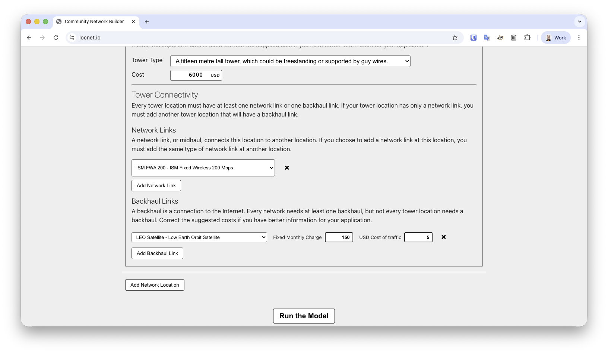
Backhaul must be added to at least one location in a network. A method should be chosen, a fixed monthly charge entered, and a cost per Mbps for traffic. The model assumes that cost of backhaul will increase over time with traffic demand, based on the USD cost of traffic per Mbps entered here. 

For each location, the model looks at provisioned backhaul to find how many will be supported in the network’s final year of operation. Then it creates a list that will hold details of the OpEx charges per Mbps that that will accrue for each user assigned to the backhaul. This is calculated based on the  average monthly use of a user during the peak hour over each year of service operation.

The data is analysed to determine if enough backhaul has been provided to meet the number of users supported by the access network. If backhaul is under-provisioned, more of the cheapest available solution is added. Then users are distributed across the backhauls proportionally to capacity and a blended cost of backhaul OpEx per user is derived. From the sum of all backhauls installed a new backhaul CapEx figure is calculated. Then a new Backhaul OpEx figure is derived from the sum of the fixed monthly cost of the aggregate backhaul, and the blended cost of backhaul per user times the number of users supported.

## 3 Run the Model
A button underneath the network section is used to run the model. 

Once it’s run a set of results will appear below, and all user input will collapse into a section above the Summary of Outcomes called “Model Parameters”. Click that button to open the user input section again and adjust parameters as required to ensure a high level of user support while also maintaining neutral or positive earnings.

### 3.1 Model Output
#### 3.1.1 Summary of Outcomes
The first section of output, a table displayed once the model is run, is a summary of outcomes described in greater detail in sections below.

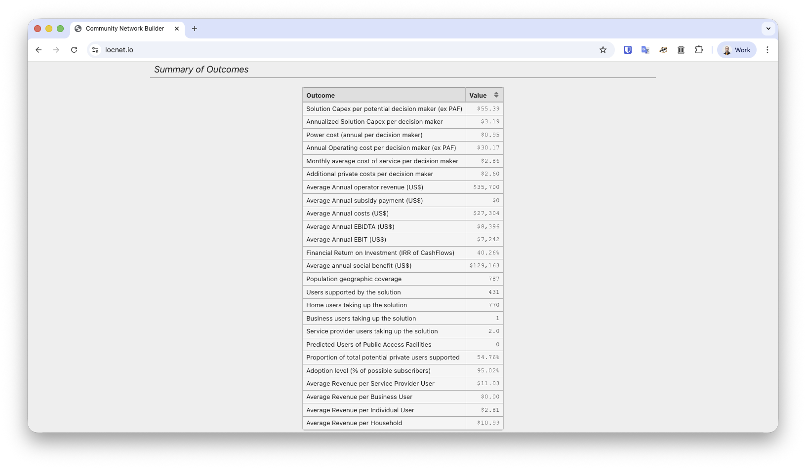
##### 3.1.1.1 Solution Capex per potential user
This is the total solution capital expenditure over the life of the project, including rates of return, divided by the total number of decision makers, that is, the sum of households, service providers and businesses.

##### 3.1.1.2 Annualised Solution Capex per potential user
##### 3.1.1.3 Power cost (annual per decision maker):
This is the total cost of providing power, capex and opex, divided by the life of the solution and divided by the number of decision makers.

##### 3.1.1.4 Annual Operating cost per potential decision maker
This is average annual Operating Expense divided by the number of decision makers, excluding those who exclusively use Public Access Facilities.

##### 3.1.1.5 Monthly average cost of service per decision maker
This value is the sum of the previous three values divided by 12 to give a monthly value of all connectivity solution costs per decision maker. It gives an indication of cost overheads that need to be covered.

##### 3.1.1.6 Additional private costs per decision maker
This is the total cost incurred by users, including equipment and service charges, divided by the average number of decision makers over the life of the solution.

##### 3.1.1.7 Average Annual operator revenue (US$)
This is the total earnings of the solution provider divided by the life of the solution.

##### 3.1.1.8 Average Annual subsidy payment (US$)
This is the total value of all subsidies divided by the life of the solution, so the average level of subsidies per year. Note, this is not the same as the timing of actual subsidies paid. For example, all Opex subsidies are assumed to be paid at the end of Year 1.

##### 3.1.1.9 Average annual costs (US$)
This is all costs including power divided by life of the solution. Again, this is not the same as the actual timing of costs.

##### 3.1.1.10 Average Annual EBIT (US$)
This is the Earnings Before Interest and Taxes over the life of the solution divided by the life of the solution. Again, this is not the same as the actual timing of actual annual EBIT.

##### 3.1.1.11 Financial Return on Investment (IRR of CashFlows)
This is the Internal Rate of Return on a cash flow basis over the life of the solution.

##### 3.1.1.12 Average annual social benefit (US$)
This is the total social benefit of the solution divided by the life of the solution. Note, at this stage the social value of the solution is rudimentary and indicative and supported by empirical evidence. It is a feature of the model that can be sued when the appropriate data becomes available.

##### 3.1.1.13 Population geographic coverage
This is the number of individuals in the community that are within the geographic coverage of the solution.

##### 3.1.1.14 Total potential users supported
This is the number of individuals in the community that are supported by the solution. 

Access network capacity in the peak hour of the final year of network operation limits the number of users supported. Sometimes more capacity is built than users are covered, or more capacity is built than the total potential users available in the study area. The users supported by a solution is limited so that the number of users supported is the smallest of:

Total potential users of the model area

Users covered by the access network

Users supported by the access network

##### 3.1.1.15 Proportion of total potential users supported
The number of users supported divided by the population geographic coverage. This value shows the technical capability of the specified solution in terms of the proportion of potential users that can be supported. For radio access networks, this is mainly determined by the signal propagation characteristics of the selected wireless technology combined with the tower height, and interacting with the area over which the population is spread, and its the vegetation and topography. A desirable value for this value is in the range 80% to 96%. In this range, potential users will be supported to an acceptable quality of service. A value below 80% will indicate congestion and lowered QoS. A value over 96% indicates ‘over provisioning’ and the associated costs will be higher than are warranted to support the current user base.

##### 3.1.1.16 Adoption level (% of possible subscribers)
This value incorporates the economic side of the model and shows the proportion of potential subscribers who adopt the solution (become subscribers), that is, they are willing to make the ‘purchase decision’ based on the cost of the service, its desirability, and the potential subscriber’s income levels. 

For businesses we assume that adoption will be equal to the adoption level of households above median income. This assumption is based on the idea that not all businesses will necessarily want their employees to be subscribers, but most will.

### 3.2 Demand and Community Benefit Assessment
The Demand and Community Benefit Assessment (CBA) table shows the expected impacts of the network at the end of its third year of operation. 

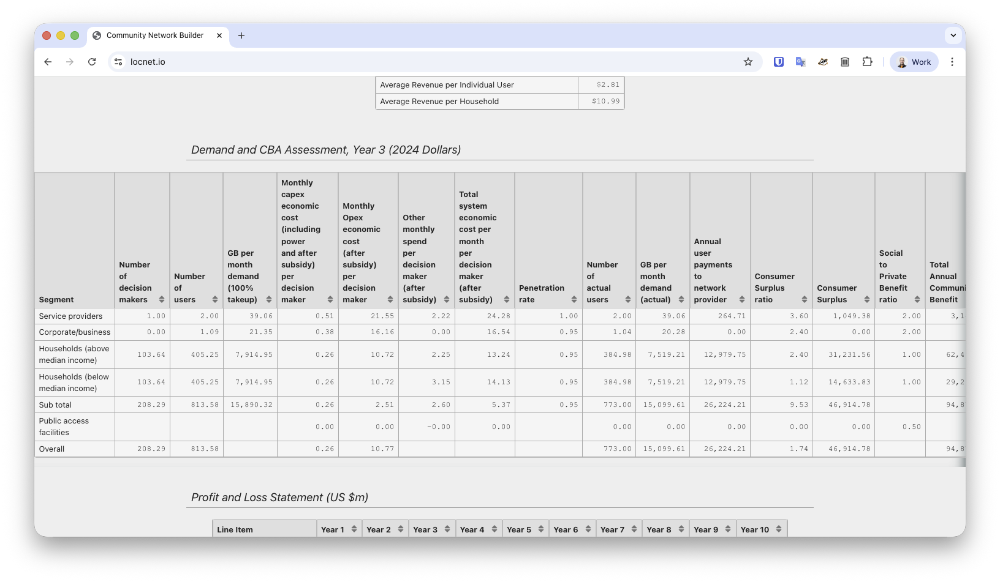
Community benefits are explored in detail in section 4.7.

### 3.3 Profit and Loss Statement
The Profit and Loss Statement provides a forecast of how a network operator could perform given the technical solution configured and the community being serviced. It draws on the demand model and predicts ultimate demand will ramp up from network launch and will eventually be met by the end of the third year of operation.

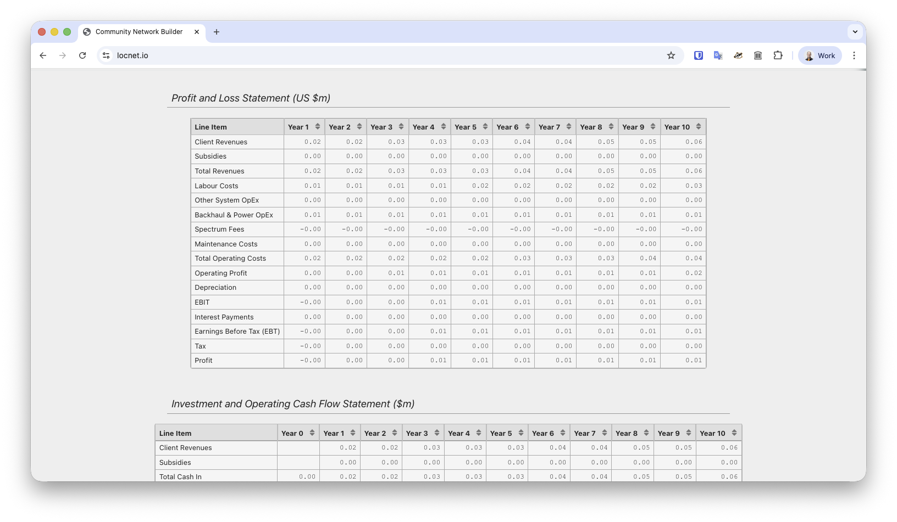
### 3.4 Investment and Operating Cash Flow Statement
The Investment and Operating Cash Flow statement is an alternative view of many elements of the Profit and Loss Statement, with a focus on cash flow. It makes clear network build requirements (Construction Spend), and how and when that initial cash deficit might be recovered.

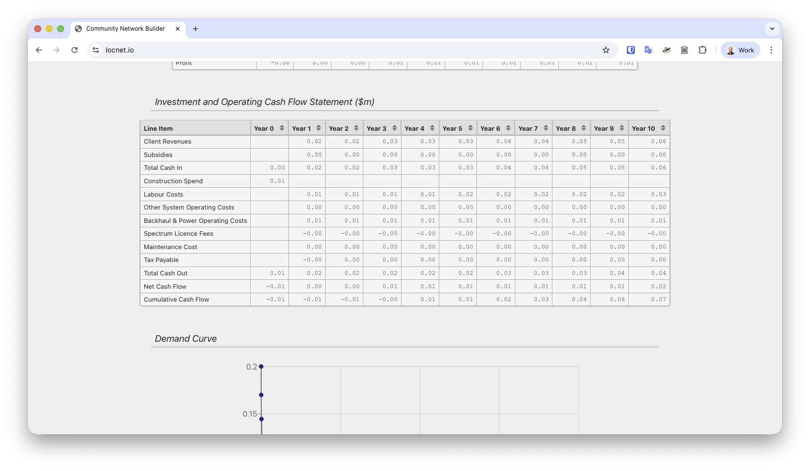
### 3.5 Demand Curve
A demand curve is a representation (mathematical or graphical) of the relationship between the price of a good or service in a market and the quantity demanded by consumers. The demand curve used in the model, explained in detail in section 4 of the documentation, is represented here.

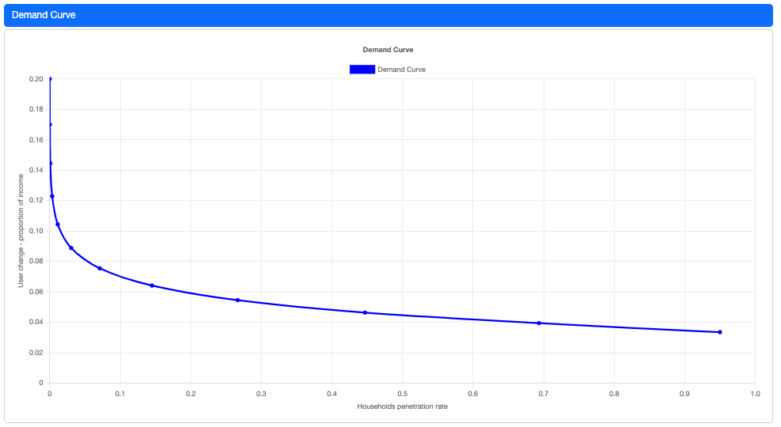
### 3.6 Network Details
This table re-states some model parameters, and summarises some key facts about the complete network, including some traffic statistics and a breakdown of costs for elements of the network.

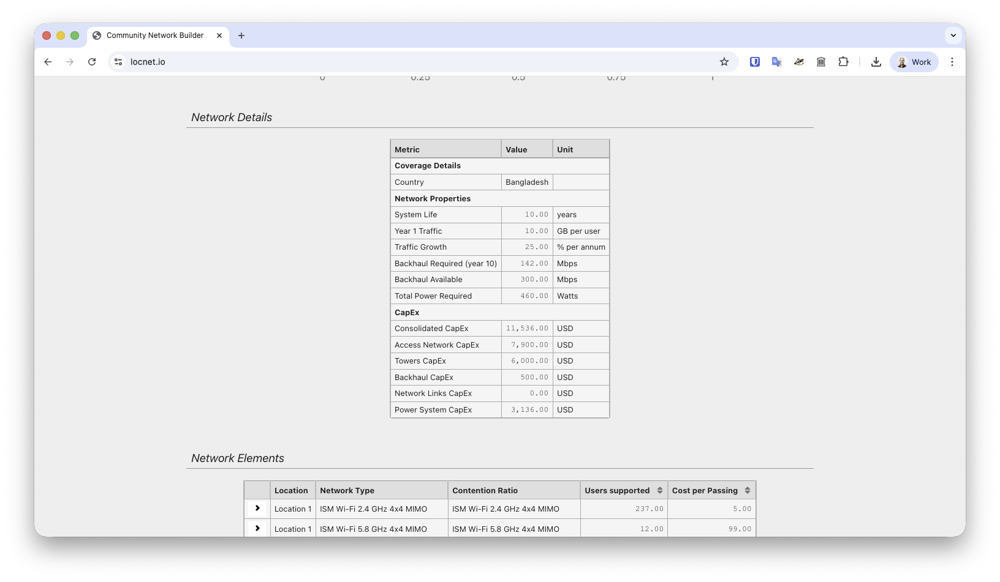
### 3.7 Network Elements
The final set of results is a detailed breakdown of each location of the technical solution. Initially presented as a summary table, each location can be expanded by clicking an icon in the first column of each row, to show detailed information on how coverage is provided from a technical perspective.

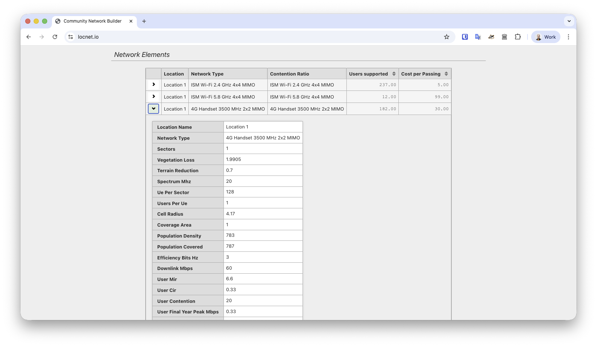
 

## 4 The Broadband Demand Module
While the BTM determines the technical and cost outcomes for each user-defined broadband solution, it does not tell us how many users will use the service. This is determined by the interaction between the price of the service and its quality characteristics, potential users’ incomes, and individuals’ preferences and willingness to pay.

In other words, the BTM determines how many can be supported technically, and the broadband demand module (BDM) ‘filters’ this according to how many users are willing to pay for the service. A demand curve for broadband services is, in effect, a way of illustrating or summarising the willingness to pay of all of the individuals in the community.

### 4.1 What is a Demand Curve
A demand curve is a representation (mathematical or graphical) of the relationship between the price of a good or service in a market and the quantity demanded by consumers. It summarises how the quantity demanded changes as the price of the product changes, assuming other factors, such as income, substitute products, the quality of product, remain constant. Typically, demand curves slope downwards from left to right, indicating that as the price decreases, the quantity demanded increases, and vice versa.

Demand curves typically show price on the vertical axis and quantity demanded (in some unit of time, typically a week or a month) on the horizontal. In the BDM, the price axis measures the price of the broadband service as a proportion of average income and the horizontal axis shows the proportion of the community adopting the service – the adoption level. Expressing these key variables in this way is consistent with the ITU’s use of GNI per capita as a measure of broadband affordability and adoption level is a useful outcome measure. 

### 4.2 Characteristics of the Demand Curve used in the Model
The characteristics of the demand curve used on the Model are based on empirical data gathered by SKC in previous studies (including a detailed willingness to pay survey) and from academic literature. SKC has significant experience in this area and there is an expanding and well-established literature on broadband demand curves. The demand curve in this version of SKC Model is something of a ‘black box’ from the point of view of the model user. It is planned, in later versions of the model, to expose some of the parameters of the demand curve to the model user. In addition, the model will need ground truthing for remote rural unserved communities in LDCs with basic economic data about representative communities to better calibrate the demand analysis - income, use of other communications solutions, capacity to pay, participation in cash economy etc.

Since the demand curve shows the level of adoption as a function of the price of the service expressed as a proportion of average income, its role in the model is central.

The demand curve illustrated, for example, indicates that, if the user charge for a broadband service is 5% of median income, the level of adoption will be slightly below 40% of the potential user population. Lower prices result in higher adoption levels and vice versa.

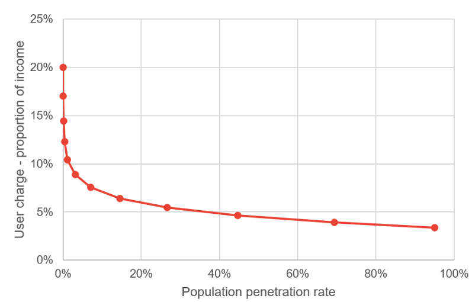
 

It can easily be seen that the position and shape of the demand curve will significantly influence the relationship between price and adoption levels. For example, if the demand curve were to shift up, any given price would be associated with a higher level of adoption.

The validity of a demand-based analysis is predicated on two assumptions:

that individuals are able to make voluntary decisions in their own interests

that individuals will pay for a service only if it makes them better off (more specifically, if their subjective evaluation of the benefit of buying the good or service is higher than the price they need to pay).

Importantly, because the analysis is grounded in demand theory, in addition to the calculation of financial outcomes, the module also generates a measure of the economic benefit arising from the operation of the broadband service within the community. The estimate is based on the concept of ‘consumer surplus’ – the benefit that consumers receive from using the services that is in excess of the price they pay to get access to it.

Consumer surplus arises directly from the consumption of broadband services – it is the core economic benefit arising from the creation of a market in which an individual can voluntarily transact in their own interests.

Consumer surplus is described diagrammatically as the area under the demand curve above the equilibrium or market price. It is a measure of the benefit that consumers receive over and above the price they need to pay.

It may be useful to distinguish more clearly economic benefits and social benefits. The community’s total economic benefits are equal to the sum of all consumer surplus for all users – community economic benefit is the sum of individual economic benefits or the sum of all consumer surpluses. [1] There may be, in addition to these private benefits, social benefits. In economic terms these are described as positive externalities and may take the form of cost savings in the provision of education and health services. Users may become a subscribers, in part, because of better access to health and education services. But as more people do this, the cost of providing these services may fall, enabling better quality services for the same cost. This is an example of an ‘external benefit’. It is external to the decision making of the individual users, but it results in a collective or social benefit.   

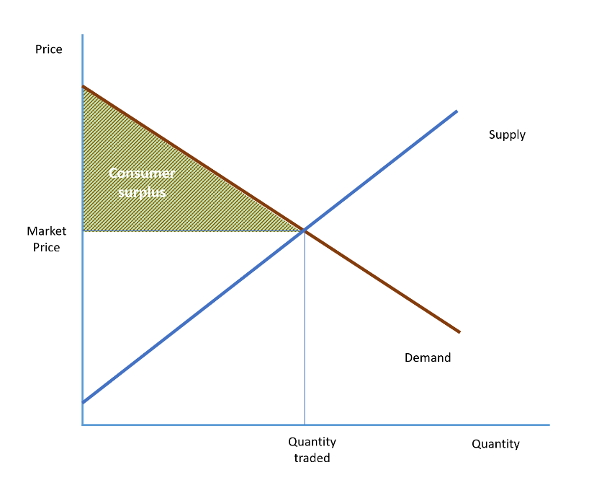
 

### 4.3 General characteristics of internet services
The cost of internet services from a customer perspective is made up of two components: 

The monthly user charge to access the service 

The cost of equipment required to access (eg router) and make use of the service (eg computer, tablet, smartphone).  It should be noted that this second group of equipment has much broader uses than internet access 

In general, it would be expected that in any community there would be a small number of users who would place very high value on internet services, call them the ‘early adopters’. These would include community service organizations (health and education), and to a lesser extent businesses that trade or could trade with outside communities. Within households there would be some users who place high value on information on entertainment (and in this context internet access is likely to be a superior good). 

However, the majority of the household and general business market would put lower value on internet access, called them the ‘mid-to-late adopters. This composition of early, mid and late adopters in the market would imply a relatively flat demand curve (i.e. high elasticity – a small change in price would cause a large change in users). There is some evidence though that ex-poste internet demand seems to be counter to that (ie high price-inelasticity at the given market penetration rate).  This is likely to be due to three aspects: 

The cost of equipment to access the service is a sunk cost, and is of lesser importance in the decision-making process 

At the point of use, the demand curve may be stepped rather than smooth downward sloping 

It is expected that once a user has access, they have more information to assess the value that access to the internet creates for them and as such are more reluctant to leave the service.  Aligned with this is that, over time, the extent of use (downloads per month) by individuals increases markedly 

### 4.4 Mathematical form of demand curve
The demand curve used in the model is given by the equation: 

UC=α+β ln(PR)𝑈𝐶=𝛼+𝛽 𝑙𝑛𝑃𝑅 

Where: 

UC is the monthly user charge + private costs for internet use as a proportion of monthly disposable income 

PR is penetration rate in potential users in the population (the proportion of the market that takes up the service 

The population is defined as individual units of decision making (and so for businesses it is the whole business - assumed to average 4 employees, and for households also assumed to be 4 potential users) 

α – the constant function (sets the height of the demand curve and defines where penetration rate will be zero 

β – the slope of the demand curve (in this case downwards)

The parameters for the model have been set by assuming that at a UC = 20% of income there will be very few users, that it will increase slightly as UC increases to around 5% and from that point the increases will be more dramatic, with penetration rates.  This is based on expectation related to observation of markets and roughly accords with a range of values that are consistent with ITU’s affordability measures for broadband services in developing economies.[1]

Based on this the underlying demand curve is as follows (see Figure 3):

UC=.0336+.0158 ln(PR)

 The model provides for two categories of household income: ten percent above median incomes and ten per cent below.

The demand curve is assumed to be shifted up 10% for those on above median incomes in the community and 10% down for those on below median incomes (acknowledging that internet access is a superior good). 

### 4.5 Using the demand curve
#### 4.5.1 Predicting number of users/penetration rate for given prices
Once the user cost is set – the penetration rate for the user decision point is calculated as: 

PR∗= e(UC−α)−β/𝑃𝑅∗= 𝑒𝑈𝐶−𝛼−𝛽

#### 4.5.2 Quantifying the private user benefit/consumer surplus
As noted above consumer surplus is a measure of the economic benefit that consumers receive when they purchase a good or service at a price lower than the maximum price they are willing to pay. It represents the difference between what consumers are willing to pay for a good or service and what they actually have to pay in the market. Essentially, it's the extra value or satisfaction that consumers get from a transaction because they pay less than what they were prepared to pay.  A transaction will not occur unless somebody values the product at more than or equal to the price, and as such it is the area under the demand curve less the total amount paid by all customers. 

Area under the curve =

∫α(PR∗−c)−β(PR∗ ln(PR∗)−PR∗−cln(c)+c) ∫𝛼𝑃𝑅∗−𝑐−𝛽𝑃𝑅∗ ln⁡(𝑃𝑅∗−𝑃𝑅∗−𝑐ln⁡𝑐+𝑐) 

 Where c is the integration constant and set close to zero 

The total amount paid by all customers =

UC− PR∗𝑈𝐶− 𝑃𝑅∗

and so the consumer surplus is the difference between the two. 

### 4.6 Using the Model to explore broadband provisioning options
Model users can experiment with various technology solutions and determine which is the ‘best fit’, within the constraints of regulations, spectrum and funding, given the characteristics of the community and the policy objectives of providing connectivity. For example, in one particular location, the 4G Handset option might show the highest quality of service outcome but might be unaffordable, given its high cost and the level of subsidy required (or unavailable due to lack of access to mobile spectrum), whereas a Wi-Fi solution might show lower quality in terms of coverage but result in higher adoption rates because the lower capital cost would mean it is possible to adopt lower subscriber pricing and it would thus be more affordable.

Essentially, the model enables users to systematically ‘trial the space’ of possibilities while managing many variables and arrive at a solution that represents a good match between needs, funding, technology and outcomes.

### 4.7 Methodology and broader community benefits
Earlier in the documentation consumer surplus was identified as the economic benefit arising from the operation of the broadband market.

There may be additional community benefits arising from the provision of connectivity. An example of community benefits might be increased employment associated with enhanced connectivity either directly through employment associated with installation and operation of the connectivity solution or additional employment created by new business opportunities as a result of enhanced connectivity. Another social benefit could include improvements in education and health outcomes.

It might be argued that the distinction between economic and social benefits is semantic. This is, to some extent, true. For example, the creation of employment would typically be seen as an economic benefit. Consumer surplus is identified in economic theory as the economic benefit arising from the operation of a marketplace.

 There is, in any change in circumstance for any community, a spectrum of benefits from less to more tangible and from relatively easy to relatively difficult to value and quantify. Intangible benefits that can be quantified can be easily included in the assessment of overall benefits provided by the model. Thus, the model provides the framework for a compact but comprehensive cost benefit analysis.

The module can also accommodate analysis of variations in ownership and operation models for the services and associated infrastructure. For example, a community ownership model might allow for a lower rate of return than a commercial one, supported by a lower cost of capital equipment or lower operating expenses for staff and premises. These conditions can be input into the model by setting the input values appropriately.

## 5 Model limitations
The model incorporates a rich set of variables associated with the provision of broadband to unserved and underserved communities. It is in the nature of all modelling that not all the complexities of the real world can be incorporated. Modeling entails trading off the benefits of modeling – analytical insights and management of complexity – against its compromises – exclusion of some real world complexity. The central proposition of the model is that connectivity increases the welfare of communities. 

The model is somewhat demanding of input data but without sufficient data to define the characteristics of a community and a scenario, a meaningful analysis of the best-fit options is, anyway, not possible. If a particular input variable is unknown, it can be estimated. Further, the model can be used to test the sensitivity of the results to different assumptions and values and this would enable testing the financial resilience of the proposed connectivity solution to a range of assumptions for critical parameter values.

## 6 Bibliography
Agarwal R. and Prasad, J. (1997). The role of innovation characteristics and perceived voluntariness in the acceptance of information technologies. Decision Science, 28(3), 557-582.

Al-Gahtani, S. S. and King, M. (1999). Attitudes, satisfaction and usage: factors contributing to each in the acceptance of information technology. Behaviour & Information Technology, 18(4), 277-297,

Anderson, B. Gale, C., Jones, M.L.R., and McWilliam, A. (2002). Domesticating broadband-what consumers really do with flat rate, always-on and fast Internet access. BT Technology Journal, 20 (1), 103-114.

BAG (2003). Australia’s Broadband Connectivity: Broadband Advisory Group’s Report to Government. NOIE, http://www.noie.gov.au/publications/NOIE/BAG/report/

BBC, Human Capital and GfK Martin Hamblin (2004), Measuring the Value of the BBC, A report by the BBC and Human Capital, http://www.bbc.co.uk/foi/docs/organisation_and_management/purpose_and_values/Measuring_the_Value_of_the_BBC.pdf

Bhattacherjee, I. (2000). Acceptance of e-commerce services: the case of electronic brokerages, IEEE Transactions on Systems, Man, and Cybernetics - Part A: Systems and Humans, 30(4), 411-420.

Bouwman, H., Carlsson, C., Molina-Castillo, F. J. and Walden, P. (2007) Barriers and drivers in the adoption of current and future mobile services in Finland. Telematics and Informatics, 24 (2), 145-160.

Briscoe, B., Odlyzko, A., Tilly, B., Metcalfe's Law is Wrong, http://www.spectrum.ieee.org/jul06/4109 first published July 2006, accessed 31/01/08

Choudrie, et al. (2003). Applying stakeholder theory to analyse the diffusion of broadband in South Korea: The importance of the government’s role. In Proceedings of the 11th ECIS on New Paradigms in Organizations, Markets and Society (Ciborra, C. et al. Ed.), Napoli, Italy.

Crandell, R. and Jackson, C. (2001), The $500 Billion Opportunity: The Potential Economic Benefit of Widespread Diffusion of Broadband Internet Access

Crandall, R., Hahn, R. and Tardiff, T, (2003) The Benefits of Broadband and the Effect of Regulation. Broadband: Should We Regulate High-Speed Internet Access? (Crandall, R.W., and Alleman, J.H.), Brookings Institution Press, 295-330

Duffy-Deno, K.T. (2003). Business Demand for Broadband Access Capacity. Journal of Regulatory Economics, Kluwer Academic Publishers, 24(3), 359-372

Dwivedi, Y.K., Choudrie, J. and U. Gopal (2003c). Broadband stakeholders analysis: ISPs Perspective. In the proceedings of the International Telecommunication Society’s Asia-Australasian Regional (ITS) Conference, Perth Australia, June 22 – 24, 2003

Eisner, J., and Waldon, T., The demand for bandwidth: second telephone lines and on-line services, Information Economics and Policy, Volume 13, Issue 3, September 2001, pp301-309]

Elliot G. and Phillips, N. (2004). Mobile Commerce and Wireless Computing Systems. Harlow: Pearson Education.

Estens, D. (2002). Connecting Regional Australia. The Report of the Estens Regional Telecommunications Inquiry.

European Space Agency (2004), Technical assistance in bridging the “digital divide”: A Cost Benefit Analysis for Broadband connectivity in Europe

Firth, L. (2005) Broadband: benefits and problems. Telecommunications Policy 29. (Mellor, D. Ed.), Mar-Apr (2-3), 223-236

Goolsbee, A. (2003), Subsidies, the Value of Broadband, and the Importance of Fixed Costs. Broadband: Should We Regulate High-Speed Internet Access? (Crandall, R.W. and Alleman, J.H.), Brookings Institution Press, 278-294

Hagan, H. (2007), IT-use and broadband in the Swedish Business Sector. Statistics Sweden, presented for the OECD in London, http://www.oecd.org/dataoecd/31/32/38822040.pdf

Herr, P. M., Kardes, F. R. and Kim, J. (1991). Effects of word-of-mouth and product-attribute information on persuasion: an accessibility-diagnosticity perspective. Journal of Consumer Research, 17(4), 454-462.

I. Ajzen, (1991).The theory of planned behavior. Organisational Behavior and Human Decision Process, 52(2), 179-211.

ITU, The affordability of ICT services 2022, Policy Brief, https://www.itu.int/en/ITU-D/Statistics/Documents/publications/prices2022/ITU_Price_Brief_2022.pdf accessed 01/07/2024

James, P. and Hills, S. (2003), A sustainable e-Europe: Can ICT Create Economic, Social and Environmental Value?: Final Report on a Consultation Process on Enterprise-Relevant Aspects of the Relationship Between the eEurope Programme and Sustainable Development. DG Enterprise. Prepared by SustainIT for the European Commission

Lee, H. and Choudrie, J. (2002). Investigating broadband technology deployment in South Korea, Brunel- DTI International Technology Services Mission to South Korea, DISC, Brunel University, Uxbridge, UK.

Lu, C. Yu, C. Liu, and J. E. Yao (2003). Technology acceptance model for wireless internet. Internet Research: Electronic Networking Applications and Policy, 13(3), 206-222.

Molloy, S.F., and Burgan, B., (2008) Creating new markets: broadband adoption and economic benefits on the Yorke Peninsula, A report prepared for the Information Economy Directorate Department of Further Education, Employment, Science and Technology Government of South Australia

Moon J.W. and Kim, Y.G. (2001).Extending the TAM for a World-Wide-Web context. Information & Management, 38(4), 217-230,

Nysveen, H., Pedersen, P. E. and Thornbjørnsen, H. (2005a). Explaining intention to use mobile chat services: moderating effects of gender. Journal of Consumer Marketing, 22(5), 247-256.

Oftel (2002), Regulatory option appraisal guidelines: assessing the impact of policy proposals, http://www.ofcom.org.uk/static/archive/oftel/publications/about_oftel/2002/roa0602.pdf

Palen, L., Salzman, M. and Youngs, E. (2001). Discovery and integration of mobile communications in everyday life. Personal and Ubiquitous Computing, 5(2), 109-122.

Pedersen, P. E. (2005). Adoption of mobile internet services: an exploratory study of mobile commerce early adopters. Journal of Organizational Computing and Electronic Commerce, 15 (3), 203-221.

PricewaterhouseCoopers, Ovum and Frontier Economics(2004), Technical assistance in bridging the “digital divide”: A Cost benefit Analysis for Broadband connectivity in Europe. Prepared for the European Space Agency, http://telecom.esa.int/telecom/media/document/PwC%20CBA%20Exec%20Summary.pdf

Rogers, E. M. (1995). Diffusion of Innovations. New York: Free Press.

Sheppard, B. H., Hartwick, J. and Warshaw, P. R. (1988). The theory of reasoned action: a meta-analysis of past research with recommendations for modifications and future research. Journal of Consumer Research, 15(3), 325-343.

Silverstone R. and Hirsche E. (1992). Consuming Technologies. London: Routledge

SQW Limited (2006), Next Generation Broadband in Scotland: Final Report. prepared for the Scottish Executive Social Research

Thompson, R., Higgins, C. and Howell, J. (1994). Influence of experience on personal computer utilization: testing a conceptual model, Journal of Management Information Systems, 11(1), 167-187.

Thompson, R., Higgins, C., and Howell, J. (1994). Influence of experience on personal computer utilization: testing a conceptual model. Journal of Management Information Systems, 11(1), 167-187.

Treasury Board of Canada Benefit Cost Analysis Guide, , http://www.tbs-sct.gc.ca/fin/sogs/revolving_funds/bcag/bca2_e.asp,

U.S. Environmental Protection Agency (2000), Guidelines for Preparing Economic Analyses, http://yosemite.epa.gov/ee/epa/eermfile.nsf/vwAN/EE-0228C-01.pdf/$File/EE-0228C-01.pdf

The affordability of ICT services 2022,ITU Policy Brief, https://www.itu.int/en/ITU-D/Statistics/Documents/publications/prices2022/ITU_Price_Brief_2022.pdf accessed 01/07/2024

