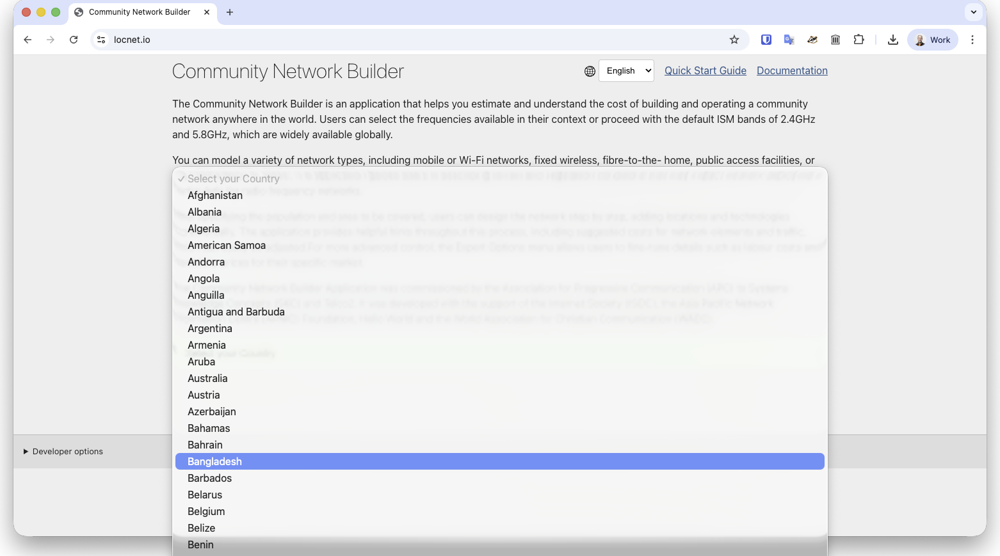
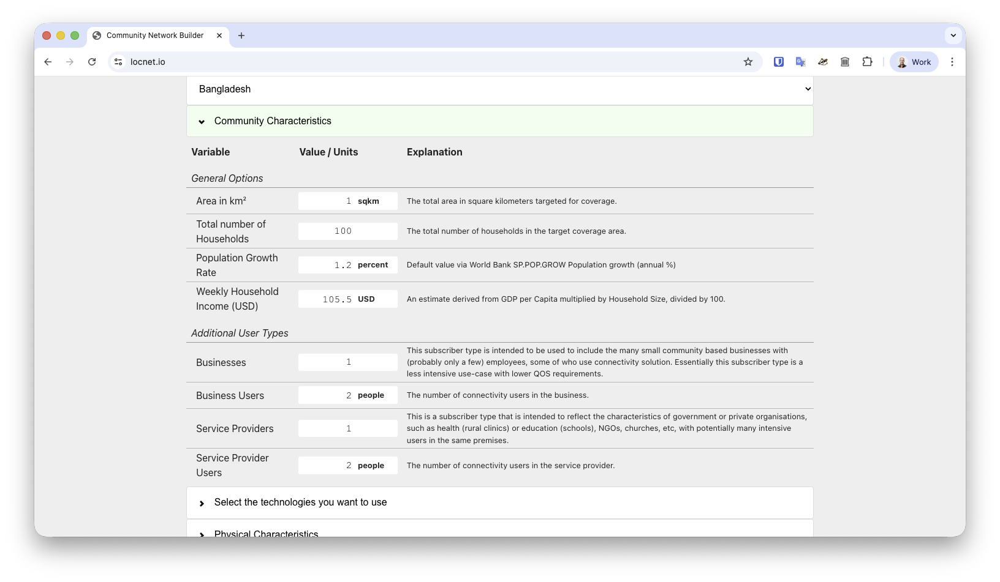
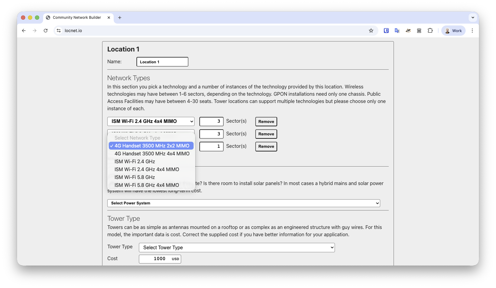
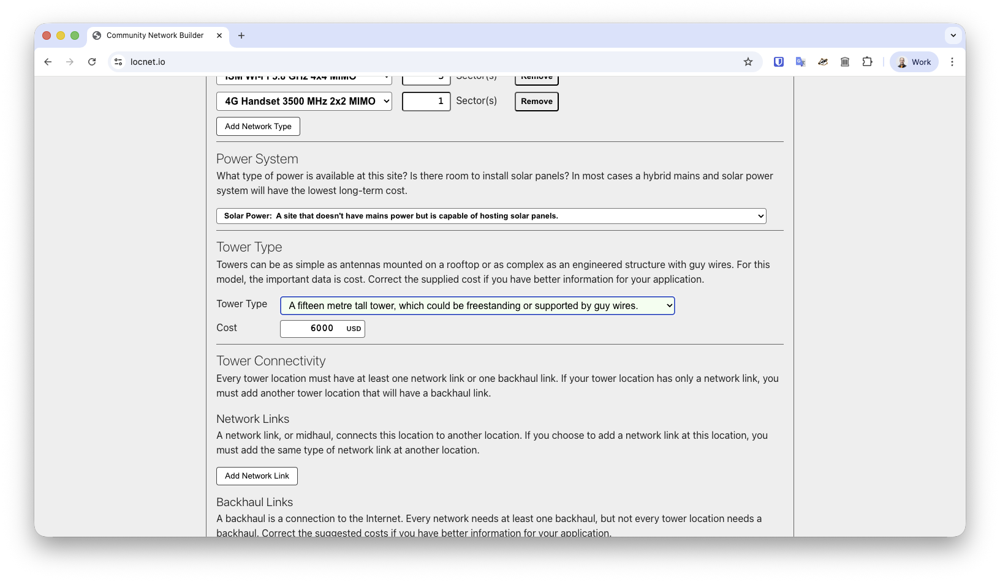

# Quick Start Guide

This guide helps introduce new users to the Community Broadband Financial Sustainability Model. It’s aim is to allow users to configure a simple network quickly, to gain an understanding of how the application works. The full documentation is appropriate for users looking to model or tune a specific scenario with a high degree of accuracy.

## Select a Country
The first significant choice to make is to pick a country. When a country is selected, a large number of model parameters are set within the model’s options and Expert Options. For a good introduction to the application, please choose a United Nations member state. In the case of non-member economies and dependancies, data used to derive household incomes and sizes, wages, population growth, and costs for electricity might be missing or invalid.

 

At the moment it’s not possible to configure a complex network scenario then change the country. If you want to change countries, it’s best to refresh the page to start fresh.

## Community Characteristics
In the first section of user input, set your community area. This area can range from 1/10th to 10,000 square kilometres. The model assumes your population (set by total number of households) is evenly distributed across this area, so take care to not set it too large.

 

If your community has businesses or community service providers (like government offices, clinics, libraries, etc.) input how many, and on average how many people each employs.

## Select a Technology, Frequencies, and Physical Characteristics
Pick as many technologies as you think you’ll want to implement, but remember that sustainable community networks are often simple.

Fixed Wireless is generally the most cost effective technology for low population densities. Fibre to the Home is the most cost effective for high population densities, and economies with large households.

The most cost effective networks are built with ISM band spectrum - the 2.4 and 5.8 GHz bands selected by default for all users of the model.

Mobile services require other frequencies to be selected. Lower frequencies perform better in areas of high vegetation, but are more expensive to implement and operate. Higher frequencies are less expensive to implement and operate, but perform poorly in the presence of vegetation.

 

## Organisation Type
Although this is a Community Network modeller, in practice many local networks are run as commercial ventures. This option has a major impact on Expert Options that impact network design, availability, staff pay, taxes, and requirements for profit. 

## Expert Options
For a “Quick Start” introduction to this model, leave these options alone.

## Network Elements
From here, the quick start guide is closely aligned with the full documentation. This is the most complex part of the application as it dates from an earlier version of the code.

## Add Location
All networks must have at least one location configured for delivering service. For a quick start, just add one location. Multiple location networks are more complex to configure.

## Add Network Type
The first choice to make is that of a network type. When you click this button, you’ll get a pull-down menu allowing you to select from the available network types. If you don’t see a network option you’re expecting to use, go back and ensure you’ve selected the technology (2.3.2) and any required frequency (2.3.3). Then click the Add Network Type button again to regenerate the list. The figure below shows the options that are available if all technologies are selected, and some (but not all) frequencies are selected in those previous sections.

For each radio network type at a location, you will also need to add a number of sectors or antennas. Most sectors technologies support between 64-128 simultaneous connections per antenna. For Public Access Facilities, you add the number of seats, or computers available. For GPON networks, you add a number of cards - each of which supports around 1,000 connections.

## Choose a Power System and Tower Type
The terminology tower is an artefact of a previous version of the application that only supported radio technologies. For this variable, it’s most important to note the cost of the hosting arrangements. If it’s a building being used for a Public Access Facility that needs $5,000 USD of fit-out work, note that in the cost.

 

## Network Links
For a quick start, skip this step.

## Backhaul Links
Backhaul, power, and staff costs are the main operational expenses of any network. Ensuring that backhaul charges are accurately estimated is important if the model is to be relevant and useful.

 

Backhaul must be added to at least one location in a network. A method should be chosen, a fixed monthly charge entered, and a cost per Mbps for traffic. The model assumes that cost of backhaul will increase over time with traffic demand, based on the USD cost of traffic per Mbps entered here.

## Run the Model
The  button underneath the network section is used to run the model.

Once it’s run a set of results will appear below, and all user input will collapse into a section above the Summary of Outcomes called “Model Parameters”.

## Summary of Outcomes
The information entered about your community and the technology choices made in building a solution all influence the Outcomes.

This summary is an overview of information contained in the Network Details and Elements sections, the Demand and Community Benefit Analysis, the Profit and Loss Statement, and the Investment and Cashflow Statement. All of these tables can be examined individually for more details. Explanations for every data element can be found in the full Documentation.
